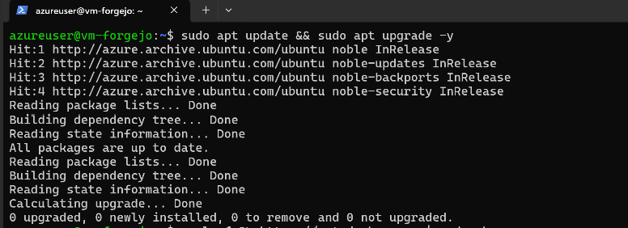
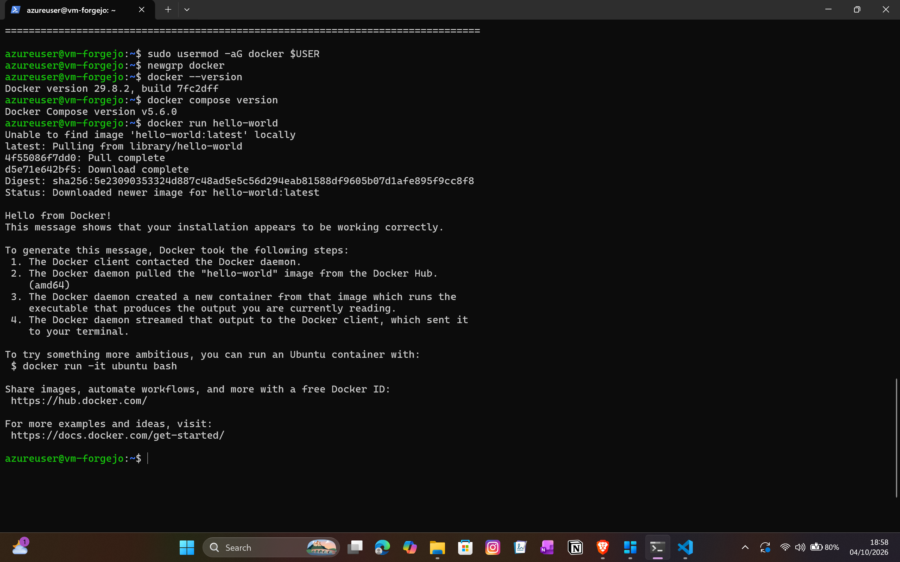
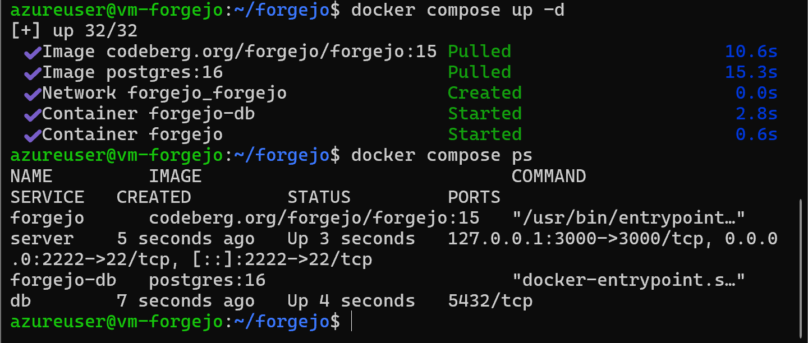
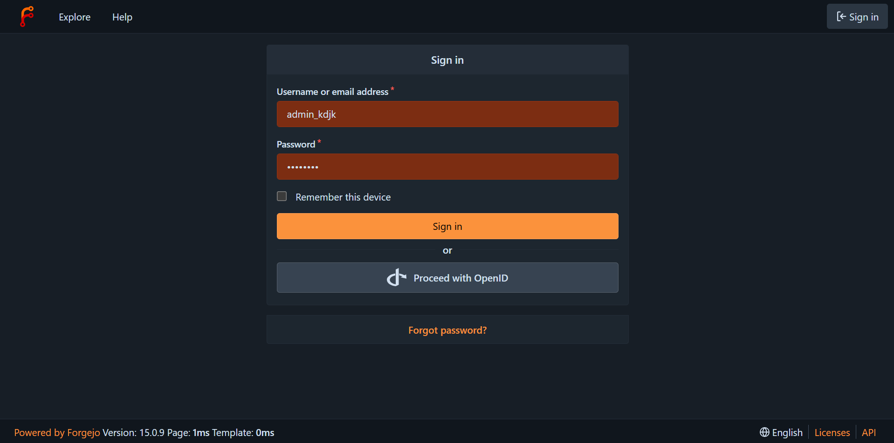
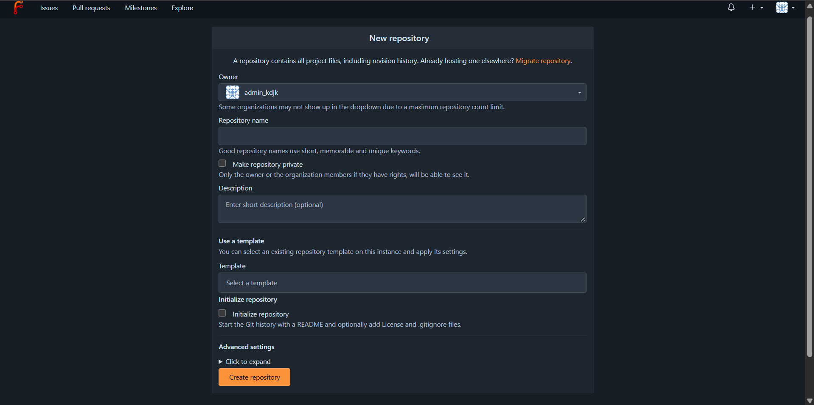
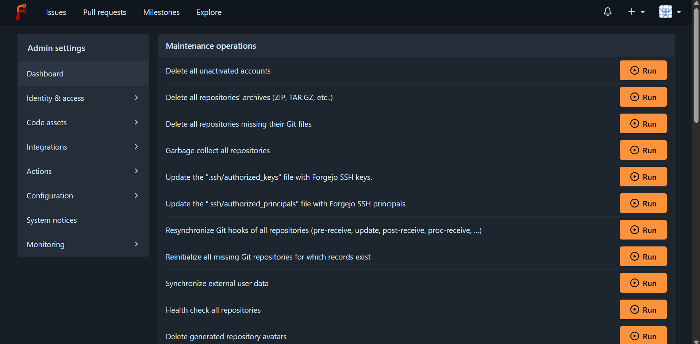

# Aplikasi Web "Forgejo"

Proyek Komunikasi Data dan Jaringan Komputer
Kelompok [ISI: nomor kelompok] | Anggota: [ISI: nama dan NIM]
Aplikasi yang sedang berjalan: https://forgejo-kdjk.malaysiawest.cloudapp.azure.com

| [Sekilas Tentang](#sekilas-tentang) | [Instalasi](#instalasi) | [Konfigurasi](#konfigurasi) | [Maintenance](#maintenance) | [Otomatisasi](#otomatisasi) | [Cara Pemakaian](#cara-pemakaian) | [Pembahasan](#pembahasan) | [Referensi](#referensi) |
| --- | --- | --- | --- | --- | --- | --- | --- |

## Sekilas Tentang

[`^ kembali ke atas ^`](#)

**Forgejo** adalah platform hosting kode sumber berbasis **Git** yang gratis, *open source*, dan dapat dipasang di server sendiri (*self-hosted*). Fungsinya mirip **GitHub** atau **GitLab**, tetapi seluruh data repositori berada di server milik kita sendiri.

Forgejo ditulis dalam bahasa pemrograman **Go** sehingga dikemas sebagai satu aplikasi yang ringan dan hemat memori. Aplikasi ini lahir sebagai *fork* dari **Gitea** dan dikelola oleh komunitas nirlaba (Codeberg e.V.). Fitur utamanya antara lain:

- repositori Git dengan akses melalui HTTPS dan SSH
- *issue tracker* lengkap dengan label dan *milestone*
- *pull request* dan *code review*
- *wiki* untuk dokumentasi proyek
- organisasi dan tim dengan pengaturan hak akses
- CI/CD melalui **Forgejo Actions**

Pada proyek ini Forgejo dipasang pada VM **Ubuntu 24.04** di **Microsoft Azure** (Azure for Students), menggunakan **Docker Compose** dengan database **PostgreSQL**, serta **Nginx** sebagai *reverse proxy* dengan sertifikat HTTPS dari **Let's Encrypt**.

## Instalasi

[`^ kembali ke atas ^`](#)

#### Kebutuhan Sistem :

- VM/VPS dengan Ubuntu 22.04 atau 24.04 (yang kami pakai: Azure, 2 vCPU, 4 GiB RAM, lokasi Malaysia West)
- RAM minimal 1 GB (disarankan 2 GB atau lebih)
- Akses SSH dengan hak `sudo`
- Domain yang mengarah ke IP server (kami memakai nama DNS dari Azure: `forgejo-kdjk.malaysiawest.cloudapp.azure.com`)
- Port **22**, **80**, **443**, dan **2222** terbuka. Pada Azure, port ini dibuka di **Network Security Group** (menu *Networking* > *Add inbound port rule*), selain di firewall server.
- IP publik bersifat **Static** agar tidak berubah saat VM dimatikan.
- Docker dan Docker Compose, Nginx, serta Certbot (dipasang pada langkah di bawah)

Arsitektur yang dibangun:

```
Pengguna --HTTPS (443)--> Nginx --> Forgejo (127.0.0.1:3000) --> PostgreSQL
Pengguna --SSH Git (2222)--------> Forgejo
```

#### Proses Instalasi :

**1. Login ke server menggunakan SSH**

Pengguna Windows dapat memakai PowerShell. Gunakan nama pengguna yang dibuat saat membuat VM (pada Azure biasanya `azureuser`).

```
$ ssh azureuser@forgejo-kdjk.malaysiawest.cloudapp.azure.com
```



**2. Perbarui paket sistem**

```
$ sudo apt update
$ sudo apt upgrade -y
```

**3. Pasang Docker**

```
$ curl -fsSL https://get.docker.com | sudo sh
$ sudo usermod -aG docker $USER
$ newgrp docker
```

Pastikan Docker sudah berjalan:

```
$ docker --version
$ docker compose version
$ docker run hello-world
```



**4. Buat direktori kerja dan file `.env`**

File `.env` menyimpan domain dan password database. Password dibuat acak agar kuat. File ini **tidak boleh** diunggah ke GitHub.

```
$ mkdir -p ~/forgejo && cd ~/forgejo
$ cat > .env <<EOF
DOMAIN=forgejo-kdjk.malaysiawest.cloudapp.azure.com
POSTGRES_PASSWORD=$(openssl rand -hex 16)
EOF
$ chmod 600 .env
```

**5. Buat file `docker-compose.yml`**

File ini mendefinisikan dua layanan: Forgejo dan PostgreSQL. Nomor versi image mengikuti [dokumentasi resmi Forgejo](https://forgejo.org/docs/latest/admin/installation/docker/).

```
$ cat > docker-compose.yml <<'EOF'
networks:
  forgejo:
    external: false

services:
  server:
    image: codeberg.org/forgejo/forgejo:15
    container_name: forgejo
    restart: always
    environment:
      - USER_UID=1000
      - USER_GID=1000
      - FORGEJO__database__DB_TYPE=postgres
      - FORGEJO__database__HOST=db:5432
      - FORGEJO__database__NAME=forgejo
      - FORGEJO__database__USER=forgejo
      - FORGEJO__database__PASSWD=${POSTGRES_PASSWORD}
      - FORGEJO__server__DOMAIN=${DOMAIN}
      - FORGEJO__server__ROOT_URL=https://${DOMAIN}/
      - FORGEJO__server__SSH_DOMAIN=${DOMAIN}
      - FORGEJO__server__SSH_PORT=2222
      - FORGEJO__server__SSH_LISTEN_PORT=22
      - FORGEJO__attachment__MAX_SIZE=100
    networks:
      - forgejo
    volumes:
      - ./forgejo:/data
      - /etc/timezone:/etc/timezone:ro
      - /etc/localtime:/etc/localtime:ro
    ports:
      - "127.0.0.1:3000:3000"
      - "2222:22"
    depends_on:
      - db

  db:
    image: postgres:16
    container_name: forgejo-db
    restart: always
    environment:
      - POSTGRES_USER=forgejo
      - POSTGRES_PASSWORD=${POSTGRES_PASSWORD}
      - POSTGRES_DB=forgejo
    networks:
      - forgejo
    volumes:
      - ./postgres:/var/lib/postgresql/data
EOF
```

Port `3000` hanya dibuka ke `127.0.0.1`, sehingga akses dari internet harus melalui Nginx. Port `2222` dipakai untuk SSH Git.

**6. Jalankan Forgejo dan PostgreSQL**

```
$ docker compose up -d
$ docker compose ps
```

Kedua container (`forgejo` dan `forgejo-db`) harus berstatus **Up**. Jika ada masalah, lihat log dengan `docker compose logs server`.



**7. Pasang Nginx dan Certbot**

```
$ sudo apt install -y nginx certbot python3-certbot-nginx
```

**8. Konfigurasi Nginx sebagai reverse proxy**

```
$ sudo tee /etc/nginx/sites-available/forgejo >/dev/null <<'EOF'
server {
    listen 80;
    server_name forgejo-kdjk.malaysiawest.cloudapp.azure.com;

    client_max_body_size 512M;

    location / {
        proxy_pass http://127.0.0.1:3000;
        proxy_set_header Host $host;
        proxy_set_header X-Real-IP $remote_addr;
        proxy_set_header X-Forwarded-For $proxy_add_x_forwarded_for;
        proxy_set_header X-Forwarded-Proto $scheme;
    }
}
EOF
$ sudo ln -s /etc/nginx/sites-available/forgejo /etc/nginx/sites-enabled/
$ sudo nginx -t
$ sudo systemctl reload nginx
```

Hasil `nginx -t` harus menampilkan *syntax is ok* dan *test is successful*.


**9. Aktifkan HTTPS dengan Let's Encrypt**

```
$ sudo certbot --nginx -d forgejo-kdjk.malaysiawest.cloudapp.azure.com
```

Isi alamat email, setujui syarat layanan, dan pilih opsi pengalihan (*redirect*) dari HTTP ke HTTPS. Uji perpanjangan otomatis dengan:

```
$ sudo certbot renew --dry-run
```


**10. Selesaikan instalasi lewat browser**

Buka `https://forgejo-kdjk.malaysiawest.cloudapp.azure.com`. Pada halaman *Initial Configuration*, nilai database dan domain sudah terisi dari konfigurasi sehingga tidak perlu diubah. Buka bagian **Administrator Account Settings**, isi *username*, *email*, dan *password* untuk akun admin, lalu klik **Install Forgejo**.


Alamat sudah memakai gembok HTTPS:


## Konfigurasi

[`^ kembali ke atas ^`](#)

Konfigurasi Forgejo dapat diatur lewat *environment variable* berformat `FORGEJO__bagian__KUNCI` pada `docker-compose.yml`. Setelah mengubahnya, terapkan dengan `docker compose up -d` dari direktori `~/forgejo`.

#### Batas upload file

Ada dua tempat yang perlu dipadankan:

- **Nginx:** `client_max_body_size 512M;` (sudah ada pada konfigurasi di atas)
- **Forgejo:** `FORGEJO__attachment__MAX_SIZE=100` (lampiran *issue* dan *pull request*, dalam MB)

Nilai di Nginx harus lebih besar daripada nilai di Forgejo. Jika tidak, unggahan akan ditolak dengan galat `413`.

#### Menutup pendaftaran publik

Agar tidak sembarang orang dapat membuat akun, matikan pendaftaran **setelah** akun admin dibuat. Tambahkan baris berikut pada bagian `environment` layanan `server`:

```
      - FORGEJO__service__DISABLE_REGISTRATION=true
```

Lalu jalankan `docker compose up -d`. Akun baru kemudian dibuat oleh admin lewat **Site Administration > User Accounts > Create User Account**.


#### Batas memori

Agar server tidak kehabisan memori, penggunaan RAM container Forgejo dapat dibatasi. Tambahkan pada layanan `server`:

```
    deploy:
      resources:
        limits:
          memory: 1g
```

#### Plugin untuk fungsi tambahan

- **Editor Markdown:** sudah bawaan. Pratinjau Markdown tersedia di README, *issue*, *pull request*, dan *wiki* tanpa plugin tambahan.
- **Login dengan Google (OAuth2):**
  1. Buat *OAuth client ID* di Google Cloud Console dengan *Authorized redirect URI* `https://forgejo-kdjk.malaysiawest.cloudapp.azure.com/user/oauth2/google/callback`.
  2. Di Forgejo, buka **Site Administration > Identity & Access > Authentication Sources > Add Authentication Source**.
  3. Pilih tipe **OAuth2** dengan provider **OpenID Connect**, isi nama `google`, *Client ID*, *Client Secret*, dan *Auto Discovery URL* `https://accounts.google.com/.well-known/openid-configuration`.

  [ISI: screenshot Authentication Sources jika dikerjakan, atau hapus bagian ini jika tidak]

- **Webhook:** setiap repositori dapat mengirim notifikasi ke layanan lain (misalnya Discord atau Telegram) lewat **Settings > Webhooks**.

## Maintenance

[`^ kembali ke atas ^`](#)

#### Backup database dan data

Dua hal yang dicadangkan: *dump* database PostgreSQL dan folder `~/forgejo/forgejo` (berisi repositori Git, lampiran, dan `app.ini`). Skrip lengkapnya ada di [`backup.sh`](backup.sh).

```
$ mkdir -p ~/scripts ~/backup
$ cp backup.sh ~/scripts/ && chmod +x ~/scripts/backup.sh
$ ~/scripts/backup.sh
$ ls -lh ~/backup
```


#### Jadwal backup otomatis (cron)

Backup dijalankan tiap Minggu pukul 02.00 (mengikuti jam server). Buka `crontab -e`, lalu tambahkan:

```
0 2 * * 0 /home/azureuser/scripts/backup.sh >> /home/azureuser/backup/backup.log 2>&1
```

Backup yang lebih tua dari 30 hari dihapus otomatis oleh skrip.


#### Uji restore

Restore diuji pada container PostgreSQL sementara agar data yang sedang dipakai tidak tersentuh.

```
$ docker run -d --name pg-test -e POSTGRES_PASSWORD=test postgres:16
$ sleep 10
$ docker exec pg-test psql -U postgres -c "CREATE USER forgejo;"
$ docker exec pg-test psql -U postgres -c "CREATE DATABASE forgejo_test OWNER forgejo;"
$ gunzip -c ~/backup/forgejo-db-$(date +%F).sql.gz | docker exec -i pg-test psql -U postgres -d forgejo_test
$ docker exec pg-test psql -U postgres -d forgejo_test -c "\dt"
$ docker rm -f pg-test
```

Jika daftar tabel Forgejo muncul, berarti *backup* dapat dipulihkan.


Salinan *backup* sebaiknya juga disimpan di luar server, misalnya diunduh ke laptop dengan `scp`:

```
$ scp azureuser@forgejo-kdjk.malaysiawest.cloudapp.azure.com:~/backup/forgejo-db-TANGGAL.sql.gz .
```

#### Update Forgejo

Buat *backup* terlebih dahulu, baca catatan rilis (terutama jika berganti versi mayor), lalu:

```
$ cd ~/forgejo
$ docker compose pull
$ docker compose up -d
$ docker image prune -f
```

#### Perpanjangan sertifikat HTTPS

Certbot memasang pewaktu (*timer*) perpanjangan otomatis. Status dapat dicek dengan `sudo certbot renew --dry-run`.

#### Menghemat kredit Azure

Mematikan server dari dalam Ubuntu **tidak** menghentikan biaya. Gunakan tombol **Stop** di portal Azure hingga status *Deallocated* jika VM tidak dipakai berhari-hari.

## Otomatisasi

[`^ kembali ke atas ^`](#)

Jika kita ingin memasang Forgejo di server baru tanpa mengetik semua perintah satu per satu, tersedia dua *script shell*:

- [`setup.sh`](setup.sh): memasang paket, Docker, firewall, Forgejo dan PostgreSQL, Nginx, serta HTTPS sekaligus. Password database dibuat acak dan disimpan di `~/forgejo/.env`.
- [`backup.sh`](backup.sh): backup database dan data Forgejo, serta menghapus backup lama.

Cara memakai `setup.sh` (domain harus sudah mengarah ke IP server dan port 80, 443, 2222 sudah terbuka):

```
$ git clone https://github.com/USERNAME/projek-forgejo.git
$ cd projek-forgejo
$ chmod +x setup.sh backup.sh
$ ./setup.sh forgejo-kdjk.malaysiawest.cloudapp.azure.com email@contoh.com
```

`setup.sh` hanya untuk server **baru**. Jika `~/forgejo/.env` sudah ada, skrip berhenti sendiri agar password database yang sedang dipakai tidak tertimpa.

[ISI: screenshot hasil uji `setup.sh` pada server/VM bersih, atau hapus kalimat ini jika tidak diuji]

## Cara Pemakaian

[`^ kembali ke atas ^`](#)

Antarmuka Forgejo mirip dengan GitHub sehingga mudah dipelajari. Berikut fungsi-fungsi utamanya beserta data contoh yang sudah kami isi.

**1. Login.** Buka alamat aplikasi, lalu masuk dengan akun yang sudah dibuat.



**2. Dashboard.** Setelah login, halaman utama menampilkan aktivitas terbaru, daftar repositori, dan organisasi.


**3. Membuat organisasi dan akun anggota.** Klik tanda **+** di pojok kanan atas, lalu pilih **New Organization**. Anggota ditambahkan lewat tab *Teams*.


**4. Membuat repositori.** Klik **+ > New Repository**, isi nama dan deskripsi, lalu centang *Initialize repository* untuk membuat README.



**5. Clone dan push lewat HTTPS dan SSH.**

```
$ git clone https://forgejo-kdjk.malaysiawest.cloudapp.azure.com/NAMA/proyek-demo.git
$ cd proyek-demo
$ echo "halo forgejo" > catatan.txt
$ git add . && git commit -m "tambah catatan" && git push
```

Untuk SSH, tambahkan *public key* di **Settings > SSH/GPG Keys**, lalu gunakan port **2222**:

```
$ git clone ssh://git@forgejo-kdjk.malaysiawest.cloudapp.azure.com:2222/NAMA/proyek-demo.git
```


**6. Issue.** Menu **Issues** dipakai untuk mencatat tugas atau bug, lengkap dengan label, *milestone*, dan penanggung jawab.


**7. Pull request.** Buat *branch* baru, *push*, lalu buka **Pull Request**. Anggota lain dapat memberi komentar dan menyetujui sebelum digabung (*merge*).


**8. Wiki.** Aktifkan wiki pada pengaturan repositori, lalu tulis dokumentasi dengan format Markdown.


**9. Site Administration.** Akun admin dapat mengelola pengguna, repositori, organisasi, dan konfigurasi sistem dari menu ini.



## Pembahasan

[`^ kembali ke atas ^`](#)

Menurut kami, **Forgejo** adalah pilihan yang baik bagi tim kecil, kampus, atau individu yang ingin memiliki layanan Git sendiri dengan biaya rendah. Instalasinya sederhana, penggunaannya mudah karena mirip GitHub, dan kebutuhan sumber dayanya kecil. Berikut kelebihannya :

- Ringan. Dapat berjalan pada server dengan RAM sekitar 1 GB.
- Instalasi relatif mudah, terutama dengan Docker Compose.
- Antarmuka mirip GitHub sehingga mudah dipelajari.
- Gratis dan *open source*, serta data sepenuhnya berada di server sendiri.
- Fitur yang cukup lengkap dalam satu aplikasi: repositori, *issue*, *pull request*, *wiki*, organisasi, dan CI/CD.
- Mendukung akses Git lewat HTTPS dan SSH.

Kekurangan yang kami temui :

- Ekosistem dan integrasi pihak ketiga tidak sebanyak GitHub atau GitLab.
- CI/CD (Forgejo Actions) memerlukan *runner* terpisah dan konfigurasi tambahan.
- Keamanan, *backup*, dan pembaruan menjadi tanggung jawab pengelola server.
- Pembaruan ke versi mayor perlu dicek manual lewat catatan rilis.
- Konfigurasi HTTPS, reverse proxy, dan firewall harus diatur sendiri.

Jika dibandingkan dengan layanan sejenis, berikut perbedaannya (informasi bersumber dari dokumentasi masing-masing layanan) :

| Aspek | Forgejo | GitHub | GitLab (self-hosted) | Gitea |
| --- | --- | --- | --- | --- |
| Model | *Self-hosted*, *open source* | Layanan cloud (SaaS) | *Self-hosted* atau SaaS | *Self-hosted*, *open source* |
| Kebutuhan sumber daya | Rendah | Tidak perlu server sendiri | Tinggi | Rendah |
| Kontrol data | Penuh | Dipegang penyedia | Penuh | Penuh |
| Biaya | Gratis, hanya biaya server | Ada paket gratis dan berbayar | Edisi komunitas gratis, ada edisi berbayar | Gratis, hanya biaya server |
| CI/CD | Forgejo Actions (perlu runner) | GitHub Actions | GitLab CI (sangat lengkap) | Gitea Actions |
| Kemudahan instalasi | Mudah | Tidak perlu instalasi | Sedang sampai sulit | Mudah |
| Tata kelola | Komunitas nirlaba | Perusahaan | Perusahaan | Perusahaan dan komunitas |

- **GitHub** paling mudah dipakai dan paling besar komunitasnya, tetapi kode tersimpan di layanan pihak ketiga.
- **GitLab** unggul pada fitur DevOps dan keamanan yang lengkap, tetapi jauh lebih berat untuk dijalankan sendiri.
- **Gitea** sangat mirip dengan Forgejo karena Forgejo berasal dari *fork* Gitea. Perbedaan utamanya ada pada tata kelola proyek dan arah pengembangannya.

[ISI: verifikasi ulang isi tabel perbandingan ke dokumentasi masing-masing sebelum dikumpulkan]

## Referensi

[`^ kembali ke atas ^`](#)

1. [Installation with Docker](https://forgejo.org/docs/latest/admin/installation/docker/) - Forgejo
2. [Forgejo Documentation](https://forgejo.org/docs/latest/) - Forgejo
3. [Configuration Cheat Sheet](https://forgejo.org/docs/latest/admin/config-cheat-sheet/) - Forgejo
4. [Install Docker Engine on Ubuntu](https://docs.docker.com/engine/install/ubuntu/) - Docker
5. [Nginx Reverse Proxy](https://docs.nginx.com/nginx/admin-guide/web-server/reverse-proxy/) - Nginx
6. [Certbot](https://certbot.eff.org/) - Electronic Frontier Foundation
7. [pg_dump](https://www.postgresql.org/docs/current/app-pgdump.html) - PostgreSQL
8. [Azure for Students](https://learn.microsoft.com/en-us/azure/education-hub/about-azure-for-students) - Microsoft
9. [ISI: tambahkan sumber lain yang kamu pakai]
